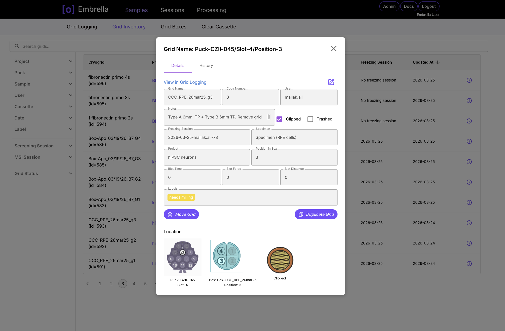
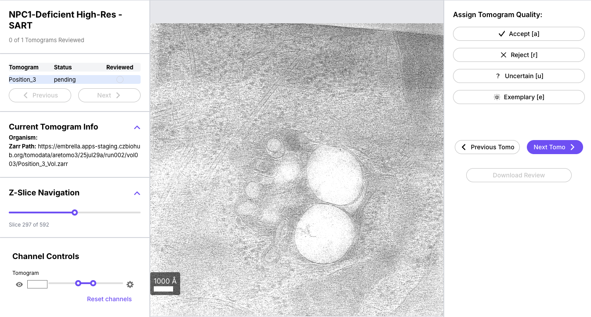

# Embrella

**An integrated experience for tracking cryo-electron tomography (cryo-ET) workflows.**
From sample preparation to data processing to curation, Embrella links metadata across
every stage of the pipeline so users can manage and standardize their data tracking in
one place.

[Get Started](userguide/overview.md){ .md-button .md-button--primary }
[Self-Host](setup/gettingstarted.md){ .md-button }
[Contributing](contributing/gettingstarted.md){ .md-button }

<!-- TODO: Graphic for Hero Image? -->

## How it works

Embrella is divided into three main categories, following a sample from the bench to a
reviewed tomogram.

- :material-snowflake:{ .lg .middle } **Sample Preparation**

  ***

  Log grids, so you always know where a sample lives and
  who has it next.

  :octicons-arrow-right-24: [Grid logging](userguide/gridlogging.md)

- :material-cog-play:{ .lg .middle } **Data Processing**

  ***

  Link grids to imaging sessions and launch pre-filled processing jobs on HPC clusters.

  :octicons-arrow-right-24: [Running workflows](userguide/launchprocessing.md)

- :material-image-search:{ .lg .middle } **Curation**

  ***

  Review completed job outputs with integrated plots and a tomogram viewer.

  :octicons-arrow-right-24: [Metadata](userguide/metadataapp.md) and [Review](userguide/reviewapp.md)

## Sample Preparation

Grid logging is where users, primarily research associates, record how and where they
placed their prepared samples. Tracking placement in shared storage means a grid can
always be found, and hand-offs to the next step happen without a spreadsheet.

<!-- IMAGE: grid logging view -->

- Track where grids were placed in shared storage such as dewars, canes, and pucks
- Hand off grids to further sample preparation steps
- Hand off grids to imaging sessions

## Data Processing

Grids are linked to imaging sessions, which carry imaging metadata forward into
processing. With that metadata in hand, Embrella can fill in most of a job for you.

<!-- IMAGE: workflow / job submission view -->

- Pre-fill processing scripts from session and grid metadata
- Submit jobs to HPC (SLURM) clusters
- Track job status through to completion

## Curation

Completed job outputs, both metadata and processed images, are surfaced in two sub-apps.

- 
  **Metadata**  
  Browse and filter the metadata produced by completed runs. Tomograms can be filtered
  using integrated plots.

- 
  **Review**  
  Review tomograms directly in the browser through the integrated viewer, idetik.

## Where to next

- :material-book-open-variant:{ .lg .middle } **User Guide**

  ***

  Step-by-step walkthroughs of each part of the app.

  :octicons-arrow-right-24: [Read the guide](userguide/overview.md)

- :material-server:{ .lg .middle } **Setup**

  ***

  Requirements and deployment for hosting Embrella at your institution.

  :octicons-arrow-right-24: [Self-host](setup/gettingstarted.md)

- :material-code-braces:{ .lg .middle } **Contributing**

  ***

  Set up a local development environment and learn the release conventions.

  :octicons-arrow-right-24: [Getting started](contributing/gettingstarted.md)

