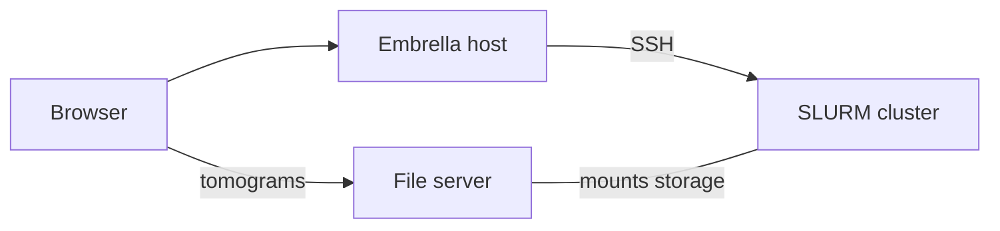

# Getting Started: Self-Hosting

!!! tip "Quick Start"

    Just want to try Embrella? Use the [Public Demo Server](https://embrella.apps-staging.czbiohub.org/)
    or run the [Quick Start](#quick-start) on your own machine. No cluster required.

## Overview

Embrella runs as a container stack on a single host. It submits processing jobs to your
SLURM cluster over SSH, and your users view tomograms through a file server that sits
on the cluster's storage.



## Quick Start {#quick-start}

Try Embrella on your own machine with [Docker](https://docs.docker.com/get-started/get-docker/)
or [Podman](https://podman.io/), using prebuilt images from `ghcr.io`.

!!! warning

    Out of the box, [cluster access](environment.md#cluster) is off and the database
    password is a public default. Use it as-is for evaluation only; see
    [Deployment](deployment.md) for production.

!!! note "Podman"

    Replace `docker compose` with `podman compose`. On Apple Silicon, first set up
    Rosetta: see [Podman on macOS](deployment.md#macos).

1.  Download the compose files into a new directory:

    ```bash
    mkdir embrella && cd embrella
    BASE=https://raw.githubusercontent.com/chanzuckerberg/embrella/main/docker/compose
    curl -fsSLO $BASE/docker-compose.yml
    curl -fsSLO $BASE/docker-compose.env
    curl -fsSLO $BASE/nginx.conf
    ```

2.  Set `DJANGO_SECRET_KEY` in `docker-compose.env`.

    ```bash
    sed -i.bak "s/change-me/$(openssl rand -hex 32)/" docker-compose.env
    ```

3.  Start the stack.

    ```bash
    docker compose up -d
    ```

4.  Create an admin account:

    ```bash
    docker compose exec backend python umbrella/manage.py createsuperuser
    ```

5.  Open [http://localhost:8080](http://localhost:8080) and sign in with that account.
    Logs are reachable with `docker compose logs`.

Stop with `docker compose down`. Data persists across restarts.

## Production Requirements

**Host:** Recommended 4 CPU cores, 8 GB RAM and 50 GB disk.

**Software:** [Docker](https://docs.docker.com/get-started/get-docker/) with Docker
Compose, or [Podman](https://podman.io/) (rootless).

**Network:** Embrella is meant to be self-hosted on your institution's network. It
integrates with your HPC filesystem and stays within the access restrictions your IT
department sets. The host must reach the cluster over SSH, and users' browsers must
reach the host and the file server.

You will also need the following, configured via [Environment Variables](environment.md):

1.  **A service account.** A cluster user that Embrella submits SLURM jobs as, with an
    SSH key the host can read.

2.  **A file server.** A [Caddy](https://caddyserver.com/docs/quick-starts/https#the-file-server-command)
    server, or equivalent, on a machine with the cluster storage mounted, serving it
    over HTTP/S. Embrella loads tomograms, thumbnails and copick data from it.

Optionally:

- **A Google OAuth client** for single sign-on with institutional Google accounts.

!!! note

    Without SSO, admins register users manually. Embrella has no email support, so
    there is no self-service sign-up or password reset.

For production installation, continue to [Deployment](deployment.md).
