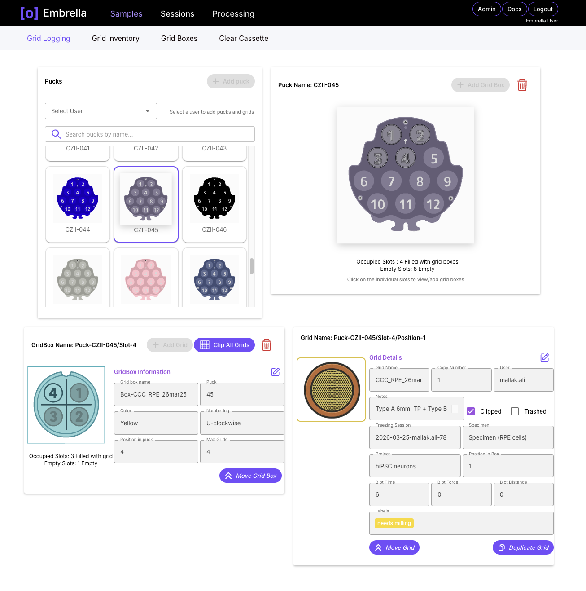

# Grid Logging

Embrella allows for grid management, starting with logging how samples were prepared.

- Track where grids were placed in shared storage such as dewars, canes, and pucks
- Hand off grids to further sample preparation steps
- Link grids to imaging sessions

  

## How To:
